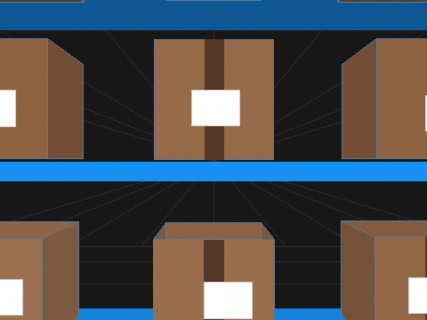
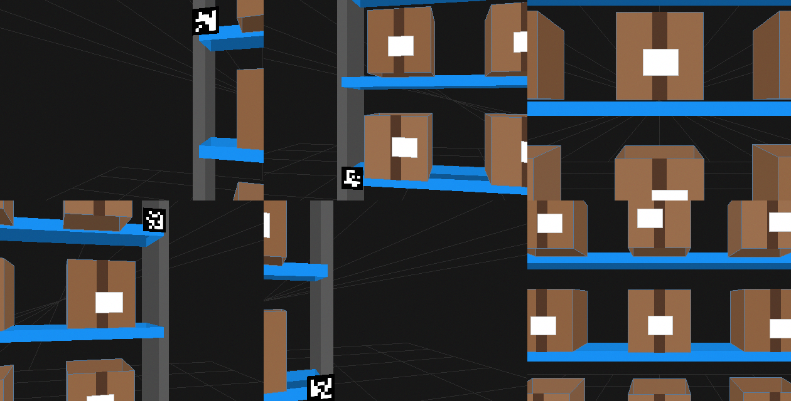
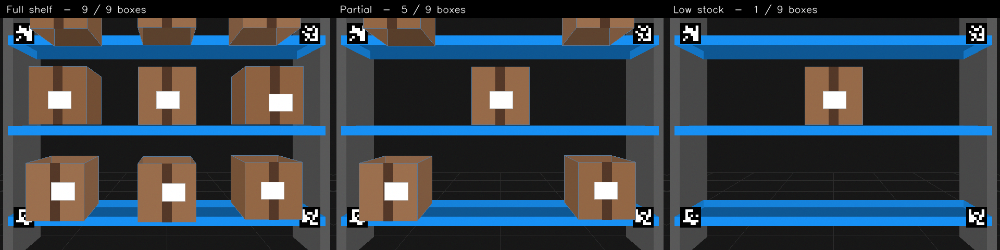

<h1 align="center">🚁 Autonomous Warehouse Drone — 3D Simulator & AI Inventory Vision</h1>

<p align="center">
  <em>A from-scratch 3D warehouse world where a virtual drone flies the aisles, "sees" the shelves through a perspective camera, and a neural network reads back its <b>pose</b> and <b>how many boxes are in stock</b> — a full synthetic-data → training → evaluation pipeline, no game engine required.</em>
</p>

<p align="center">
  
  
  
  
  
</p>

<p align="center">
  
</p>

> The animation above is **rendered by this repository's own engine** — every frame is the synthetic view the drone's camera produces, the same images the AI is trained on.

---

## ✨ What makes this interesting

Most "drone + CV" projects need a heavy game engine, a GPU and a display. This one renders a **convincing 3D warehouse with pure `OpenCV` + `NumPy`** (perspective projection via `cv2.projectPoints`) — so it runs **headless, anywhere**, and can generate thousands of labelled training images in minutes.

| | |
|---|---|
| 🏗️ **3D world from scratch** | Shelves, support beams, cardboard boxes (with shipping tape & labels), ArUco corner markers, floor grid, drone "searchlight" vignette and camera noise — all projected from 3D to 2D by hand. |
| 🎯 **Pose regression** | A CNN reads a single camera frame and regresses the drone's 3D pose `(x, y, z, yaw)`. |
| 📦 **Inventory counting** | A multi-label head reads shelf occupancy and counts how many of the 9 slots hold a box. |
| 🧪 **Honest baselines** | Classical ML baselines (scikit-learn) vs. the CNN, with a shared evaluation harness. |
| 🔌 **Optional Unity bridge** | A FastAPI inference server can stream predictions to a photoreal Unity warehouse (the heavy Unity assets are *not* bundled — see notes). |

## 🖼️ The world the drone sees

**Same shelf, different drone viewpoints** (real perspective parallax):



**Inventory states the counter must distinguish:**



## 🧠 How it works

```
                3D warehouse scene (shelves, boxes, ArUco markers)
                                  │
              cv2.projectPoints   │  perspective projection from drone pose (x,y,z,yaw)
                                  ▼
                    Synthetic camera frame (640×480)  ──►  labelled dataset
                                  │
              ┌───────────────────┴────────────────────┐
              ▼                                          ▼
     Pose-regression CNN                        Inventory / occupancy head
     predicts (x, y, z, yaw)                    counts boxes on the shelf
              │                                          │
              └───────────────────┬────────────────────┘
                                  ▼
                   Evaluation (MAE / MSE, counting accuracy)
                   + optional FastAPI server for Unity streaming
```

## 📁 Project Structure

```text
simulation.py              # Interactive 3D simulator (Pygame/OpenGL) with A* flight
generate_dataset.py        # Synthesizes labelled camera frames for training
train_cnn.py               # Trains the pose-regression / counting CNN (PyTorch)
train_baseline.py          # Classical ML baselines (scikit-learn)
evaluate.py                # Pose error metrics (MAE, MSE)
evaluate_inventory.py      # Inventory-counting accuracy
inference_server.py        # FastAPI server (streams predictions to Unity)
config.yaml                # Scene & dataset configuration
src/
  simulation/
    perspective_renderer.py  # ★ Headless OpenCV 3D renderer (makes the images above)
    warehouse_scene.py       # Scene layout: shelves, boxes, markers
    drone_camera.py          # Camera intrinsics & pose helpers
    path_planner.py          # A* path planning through the aisle
  models/
    pose_cnn.py              # CNN for pose regression
    baseline_models.py       # Classical baselines
    hybrid_estimator.py      # Marker-aided pose refinement
  vision/
    aruco_detector.py        # ArUco marker detection
    inventory_counter.py     # Box-counting logic
  utils/                     # config, dataset, metrics, plotting, seeding
docs/                        # Rendered showcase images & GIF (this README)
models/                      # Pretrained baseline scalers/regressor (.joblib)
```

## 🚀 Quickstart

```bash
pip install -r requirements.txt        # opencv-python, numpy, torch, scikit-learn, fastapi ...

# 1) Generate a synthetic dataset (headless — no display needed)
python generate_dataset.py

# 2) Train the baseline and the CNN
python train_baseline.py
python train_cnn.py

# 3) Evaluate pose accuracy and inventory counting
python evaluate.py
python evaluate_inventory.py

# Or run the whole pipeline end-to-end:
python run_all.py
```

Render your own showcase frames straight from the engine:

```python
from src.simulation.perspective_renderer import render_warehouse_view
boxes = {(lvl, col): True for lvl in range(3) for col in range(3)}   # full shelf
frame = render_warehouse_view(x_cam=0.0, y_cam=0.0, z_cam=0.45, yaw_cam=0.0, boxes_active=boxes)
# frame is a (480, 640, 3) BGR image — save with cv2.imwrite(...)
```

## ⚙️ Configuration

All scene parameters live in [`config.yaml`](config.yaml): camera focal length, shelf geometry (3 levels × 3 columns), ArUco marker placement, image size, and dataset split sizes.

## 📝 Notes

- The **interactive** `simulation.py` uses Pygame/OpenGL; the **dataset/showcase** renderer (`perspective_renderer.py`) uses only OpenCV and runs anywhere.
- The original **Unity "Robotics Warehouse"** assets (hundreds of MB of textures) are **intentionally not committed** — `inference_server.py` documents how to connect your own Unity scene over WebSockets/FastAPI.
- Datasets and large model checkpoints are excluded; everything regenerates from the scripts above.

---

<p align="center"><sub>Built as a deep-learning course project · simulator, data pipeline, models and evaluation all written from scratch.</sub></p>


---

<sub>📦 Part of my <a href="https://github.com/Nurassyl-labs/ai-ml-portfolio">AI/ML portfolio</a>.</sub>
